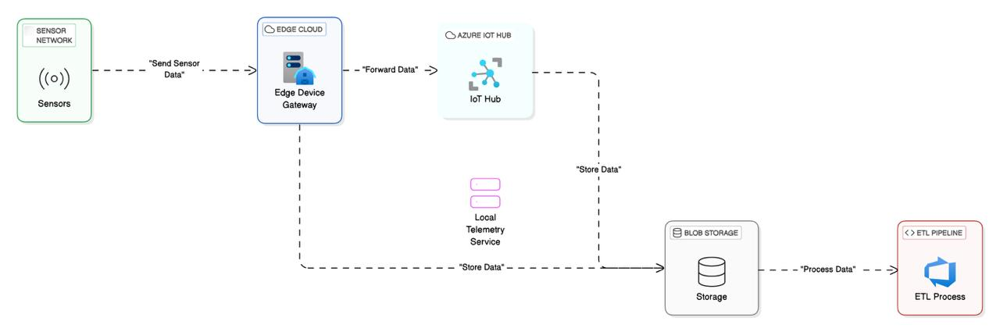
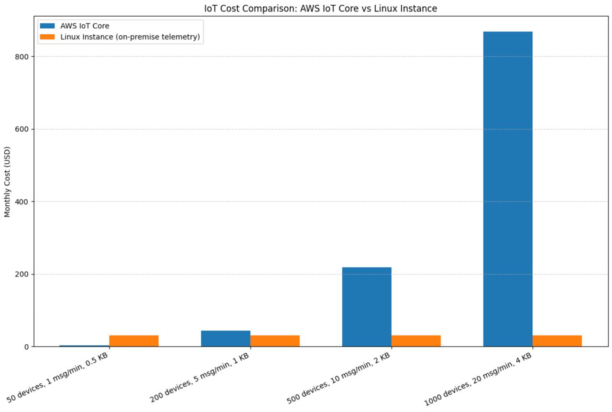

# Self-Hosted Telemetry Service

A lightweight, self-hosted telemetry framework designed to bring sensor data processing to the edge and dramatically reduce costs compared to cloud solutions like Azure IoT Hub.



---

## Overview

The issuse was raised while we were setting up a pipeline for IoT hub azure and the the way IoT hub was metering the bill based on data throughput and volume, was really aggressive. Therefore, this project is an attempt to **cut down on billing** while maintaining a minimal, custom telemetry using self hosted instances.

Our experiments revealed that Azure IoT Hub charges approximately \$250–\$300 per month for around 140 KB/s of data throughput, while the same volume of data processed on our on-premise telemetry service costs only about \$20. This significant cost reduction validates the value of moving telemetry processing to the edge.



For this project, we built a custom Golang server that simulates sensor data. We then defined individual telemetry processes in a dedicated `processes` directory. These processes can be orchestrated via a `config.yaml` file, providing flexibility and control over how telemetry data is handled.

---

## Project Structure

- **Custom Golang Server**
  A self-built server written in Golang to simulate sensor data for this project.

- **Processes Directory**
  Contains individual telemetry processes that perform data streaming and handling. These processes are orchestrated through the `config.yaml` file.

- **Configuration File (`config.yaml`)**
  Defines and manages the orchestration of different processes, allowing easy customization of the telemetry pipeline.

- **Output**
  Data is streamed and stored as CSV files under the `output/csv/` directory, with each file named by its timestamp.

- **Documentation & Assets**
  Includes architectural diagrams and other assets in the `docs/` directory.

---

## Quick Start

Install the required Python dependencies:

```bash
pip3 install -r requirements.txt
```

Run a full telemetry simulation:

```bash
make simulation
```

Test the API endpoint with a sample request:

```bash
make curl
```

---

## Running Individual Data Streams

Start specific telemetry processes (e.g., `p1`, `p2`, etc.):

```bash
make process p=p1
make process p=p2
make process p=p3
make process p=p4
```

Each process streams data to CSV files located in:

```
output/csv/<timestamp>.csv
```

---

## Output Folder Structure

Example for process `p1`:

```
output/
└── csv/
    ├── 1743834567.csv
    ├── 1743834568.csv
    └── ...
```

Each CSV file represents streamed data captured at a specific timestamp.

---

## Experiments & Cost Comparison

Our experiments highlighted the aggressive pricing of Azure IoT Hub. For roughly 140 KB/s data throughput:

- **Azure IoT Hub:** Approximately \$250–\$300 per month.
- **On-Premise Telemetry Service:** Approximately \$20 per month.

This cost benefit demonstrates that by processing telemetry data on edge devices, it’s possible to achieve significant savings while retaining control and flexibility over sensor data management.
